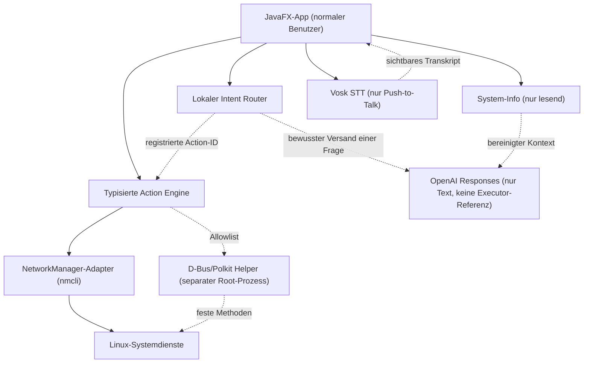

# Architektur

## Ziel

Die Anwendung trennt Anzeige, lokale Aktionen, privilegierte Aktionen und Online-KI technisch. In
Phase 18 existieren die unprivilegierte UI, sichere Systemerkennung, das Live-Dashboard, eine
allowlist-basierte lokale Action Engine, Fachgrenzen für NetworkManager und PipeWire-Pulse sowie
eine strikt textliefernde Speech-to-Text-Grenze und ein separater privilegierter Helper.



## Modulgrenzen

- `app` ist der Composition Root. Nur hier werden konkrete Implementierungen verbunden.
- `core` enthält plattformneutrale Modelle und Infrastruktur.
- `ui` kennt darstellbare, unveränderliche Daten, aber keine Prozess- oder Root-Schnittstelle.
- `system-info` liest lokale Daten und betreibt den lastarmen Dashboard-Monitor.
- `input.voice` öffnet ein gewähltes Mikrofon nur während Push-to-Talk und liefert ausschließlich
  Transkriptereignisse. Es besitzt weder Dispatcher- noch KI-Abhängigkeit.
- `input.intent` klassifiziert deterministisch und offline. Es kann eine registrierte Action-ID als
  Daten liefern, besitzt aber selbst keine Dispatcher-Referenz. Fragen bleiben reine Textdaten.
- `modules/network` enthält ausschließlich Netzwerkmodelle, Validierung und den Manager-Vertrag.
- `modules/audio` enthält ausschließlich Audiomodelle, Mixer-Validierung und den Manager-Vertrag.
- `ui` erhält den Netzwerkmanager als Fachschnittstelle und kennt weder `nmcli` noch Prozess-APIs.
- `modules/diagnostics` koordiniert lesende Fachbefunde und redigiert sie zentral.
  `platform-linux` besitzt die festen Probe-Argumentlisten; nur der bereinigte Report erreicht UI
  oder einen bewusst vorbereiteten KI-Entwurf.
- `modules/packages` besitzt Paketmodelle, Cache, Fortschritt und kurzlebige
  Transaktionsvorschauen. Es kennt weder D-Bus noch Prozess-APIs.
- `modules/security` modelliert einzelne Befunde statt eines pauschalen Scores. Sein Backend ist
  lesend; nur der schmale Firewall-Gateway darf den Helper ansprechen.
- `modules/hardware` enthält nur Hardwaremodelle, Bericht und Redaction. Der Linux-Adapter liest
  sichere sysfs-/procfs-Felder und feste optionale Werkzeuge, jedoch keine Seriennummerndateien.
- `modules/storage` bleibt lesend und begrenzt Dateianalyse auf das konfigurierte Benutzer-Home.
- `modules/snapshots` trennt Snapper-Status von typisierten Helper-Mutationen; Löschung verlangt
  eine exakte zweite Eingabe der Snapshot-ID.
- `modules/services` trägt den Scope in jedem Modell. Nur `SYSTEM` erreicht D-Bus/Polkit,
  `USER` wird unprivilegiert mit festen `systemctl --user`-Argumenten verarbeitet.
- `modules/processes` akzeptiert Aktionen nur für PIDs aus dem letzten Snapshot und sperrt
  kritische oder nicht vollständig identifizierbare Prozesse.
- `modules/display` und `modules/power` modellieren Hardwarefähigkeiten explizit. Der Linux-Adapter
  nutzt KScreen, sysfs, EGL/Vulkan und power-profiles-daemon nur, wenn sie vorhanden sind.
- Anzeige- und Energieänderungen besitzen feste Executables und getrennte, validierte Argumente.
  Suspend/Hibernate bleiben zusätzlich durch systemd/logind-Policy und UI-Bestätigung geschützt.
- X11-Werkzeuge wie `xrandr` oder `glxinfo` sind keine Kernabhängigkeit.
- `platform-linux` liest Pacman-Daten mit `LC_ALL=C`, begrenzter Ausgabe und getrennten
  validierten Argumenten. Nur der Mutation-Gateway kennt `helper-api`.
- `platform-linux` enthält typisierte Adapter. Der aktuelle Prozessadapter akzeptiert eine absolute
  Executable und eine getrennte Argumentliste. `nmcli` wird nur über feste Argumentformen und
  validierte Bezeichner verwendet; freie Shell-Schnittstellen sind verboten.
- `ai` enthält nur Provider-, Prompt- und Textmodelle. Sein Gradle-Modul besitzt weder eine
  Projektabhängigkeit zu `core`, `input`, `ui`, `platform-linux` noch zum Helper.
- `ai.knowledge` akzeptiert ausschließlich Registry-URLs der offiziellen CachyOS-/Arch-Wikis.
  Dokumente werden zu reinem Text reduziert, auf Prompt-Injection-Marker geprüft, lokal gecacht und
  nur als ausdrücklich unvertrauenswürdiger Kontext an den Provider angefügt.
- `helper/helper-api` beschreibt nur acht typisierte D-Bus-Methoden und ein begrenztes
  Fehlerprotokoll. Es gibt keine Methode für freien Shelltext oder freie Executables.
- `helper/privileged-helper` ist ein eigener, per System-D-Bus aktivierbarer Root-Prozess. Er
  autorisiert den eindeutigen Bus-Absender mit Polkit, prüft alle Parameter unabhängig erneut,
  verwendet ausschließlich absolute Executable-Allowlists und auditiert ohne Nutzparameter.

## Nebenläufigkeit

Systemzugriffe und Netzwerkoperationen dürfen den JavaFX Application Thread nicht blockieren.
Spätere Adapter liefern abbrechbare asynchrone Ergebnisse; UI-Aktualisierungen werden auf den
JavaFX-Thread zurückgeführt. Polling wird capability- und sichtbarkeitsabhängig begrenzt.

## Konfiguration und Daten

`XdgPaths` bildet diese Basisverzeichnisse ab:

```text
$XDG_CONFIG_HOME/cachyos-control-center
$XDG_DATA_HOME/cachyos-control-center
$XDG_CACHE_HOME/cachyos-control-center
```

Fehlende oder relative XDG-Pfade fallen sicher auf die entsprechenden Verzeichnisse unter dem
Benutzer-Home zurück. Secrets gehören später in Secret Service/KDE Wallet, nie in SQLite.

## Versionsbasis (30. Juli 2026)

- Java 21 LTS, lokal geprüft mit Eclipse Temurin 21.0.12
- Gradle 9.6.1
- JavaFX 21.0.12
- JUnit 5.14.4
- Spotless 8.9.0
- Checkstyle 13.9.0
- Jackson 2.22.0
- Vosk Java 0.3.45 (neueste auf Maven Central verfügbare Desktop-Bibliothek; Upstream-Release 0.3.50)
- Offizielles OpenAI Java SDK 4.43.0
- jsoup 1.23.1
- dbus-java 5.2.0
