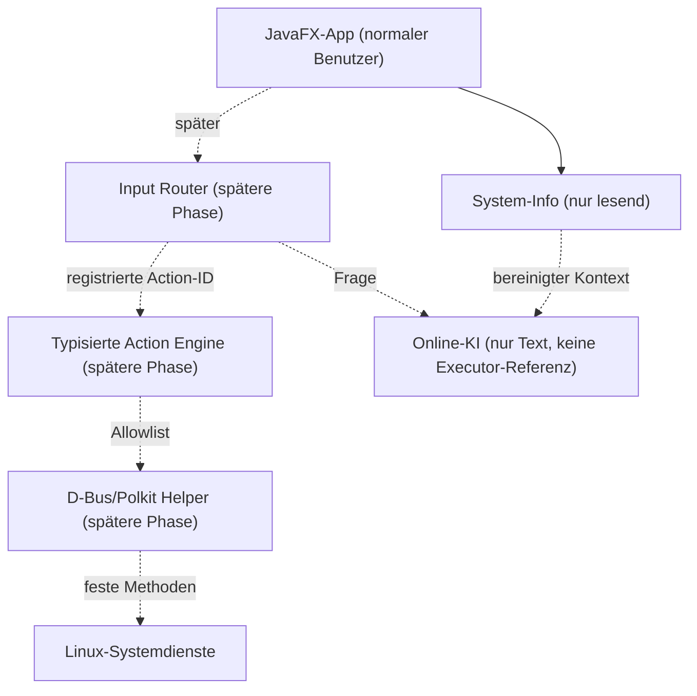

# Architektur

## Ziel

Die Anwendung trennt Anzeige, lokale Aktionen, privilegierte Aktionen und Online-KI technisch. In
Phase 0 existieren nur die unprivilegierte UI, gemeinsame Infrastruktur und eine sichere
Plattform-Erkennung.



## Modulgrenzen

- `app` ist der Composition Root. Nur hier werden konkrete Implementierungen verbunden.
- `core` enthält plattformneutrale Modelle und Infrastruktur.
- `ui` kennt darstellbare, unveränderliche Daten, aber keine Prozess- oder Root-Schnittstelle.
- `system-info` liest Daten. Phase 0 nutzt ausschließlich JVM-Eigenschaften und ausgewählte
  Sitzungsvariablen.
- `platform-linux` wird später typisierte Adapter enthalten. Freie Shell-Schnittstellen sind
  verboten.
- `ai` darf später weder `core.action`-Executor noch `platform-linux` oder den Helper als
  Abhängigkeit erhalten.
- `helper` ist kein Bestandteil des GUI-Prozesses und wird erst in Phase 13 implementiert.

## Nebenläufigkeit

Systemzugriffe und Netzwerkoperationen dürfen den JavaFX Application Thread nicht blockieren.
Spätere Adapter liefern abbrechbare asynchrone Ergebnisse; UI-Aktualisierungen werden auf den
JavaFX-Thread zurückgeführt. Polling wird capability- und sichtbarkeitsabhängig begrenzt.

## Konfiguration und Daten

`XdgPaths` bildet diese Basisverzeichnisse ab:

```text
$XDG_CONFIG_HOME/cachyos-control-center
$XDG_DATA_HOME/cachyos-control-center
$XDG_CACHE_HOME/cachyos-control-center
```

Fehlende oder relative XDG-Pfade fallen sicher auf die entsprechenden Verzeichnisse unter dem
Benutzer-Home zurück. Secrets gehören später in Secret Service/KDE Wallet, nie in SQLite.

## Versionsbasis (30. Juli 2026)

- Java 21 LTS, lokal geprüft mit Eclipse Temurin 21.0.12
- Gradle 9.6.1
- JavaFX 21.0.12
- JUnit 5.14.4
- Spotless 8.9.0
- Checkstyle 13.9.0

